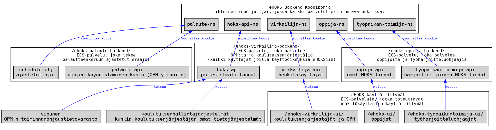
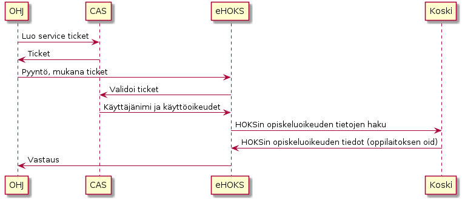
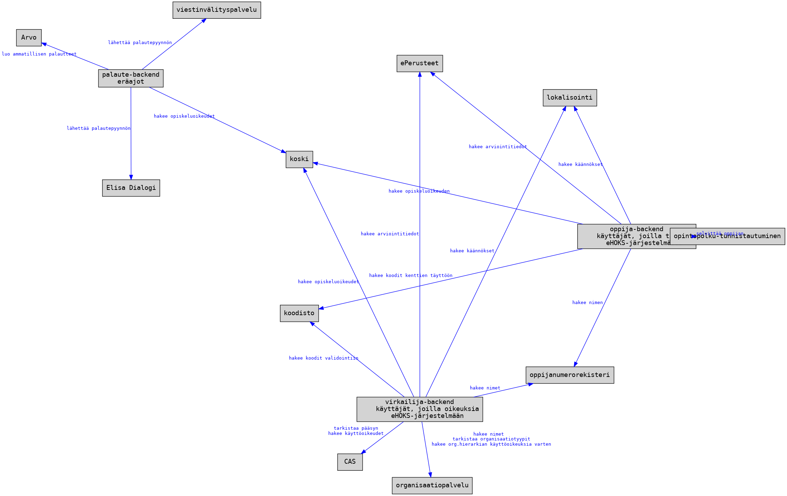

# eHOKS

## Arkkitehtuurista

eHOKS-backend on jaettu kahteen osaan: virkailija ja oppija. Virkailijan puoli
käsittää virkailijan käyttöliittymän rajapinnat ja datan tuontiin tarkoitetut
rajapinnat.



Tällä hetkellä sovellus jakaa koodipohjan eri osien välillä ja ainoastaan
rajapintojen polut on jaettu palveluittain.

## Teknologiat

### Frontend

[Github Repository](https://github.com/Opetushallitus/ehoks-ui)

### Backend

+ [Clojure 1.9.0](https://clojure.org/)
+ [Clojure.test](https://clojure.github.io/clojure/clojure.test-api.html)
+ [Compojure-api 2](https://github.com/metosin/compojure-api/)
+ [Leiningen](https://leiningen.org/)
+ [PostgreSQL 9.5](https://www.postgresql.org/docs/9.5/static/index.html)
+ [Flyway](https://flywaydb.org/)
+ [clj-http](https://github.com/dakrone/clj-http)
+ [Cheshire](https://github.com/dakrone/cheshire)
+ [Environ](https://github.com/weavejester/environ)
+ [Logback](https://logback.qos.ch/)
+ [tools.logging](https://github.com/clojure/tools.logging)

Muut riippuvuudet:

+ Podman tai Docker, kehitysympäristön tietokantaa varten
+ Ehkä: `psql`, kehitysympäristön tietokannan tutkimiseen
+ Ehkä: `make` automaatiosääntöjen käyttöön (ks alla)
+ Ehkä: `graphviz` tietokantakaavioihin kun tekee `make schemaDoc`
+ Ehkä: `curl` jos haluaa käyttää rajapintaa suoraan (esim luoda testidataa)

#### RESTful API
Backend pyrkii seuraamaan
[RESTful](https://en.wikipedia.org/wiki/Representational_state_transfer)
periaatteita. Kaikki vastaukset (paitsi no content) sisältävät meta- ja
dataobjektit.

Avaimet seuraavat Clojuren notaatiota.

## QA

Noudatetaan kehittäjien kesken sovittuja [koodikäytänteitä](doc/code-guidelines.md).

Repossa on `.editorconfig` jonka avulla voit kertoa editorillesi käytettävät
tyylit.

### Testien ajaminen

Kerran:

``` shell
lein test
```

Muutoksista:

``` shell
lein auto test
```

Testien kattavuus:

``` shell
lein with-profile test cloverage
```

### Lintterit

Staattiset linterit ajetaan:

``` shell
lein checkall
```

tämä ajaa Kibit, Bikeshed, Eastwood ja cljfmt kerralla. Jokainen työkalu on
ajettavissa myös erikseen:

``` shell
lein kibit
lein bikeshed
lein eastwood
lein cljfmt check
```

### Lisää tietoa

+ [kibit](https://github.com/jonase/kibit)
+ [lein-bikeshed](https://github.com/dakrone/lein-bikeshed)
+ [eastwood](https://github.com/jonase/eastwood)
+ [cljfmt](https://github.com/weavejester/cljfmt)

## Kehitys

### Ohjelman ajaminen

Ohjelmalle voi antaa parametrina sovelluksen nimen. Nimi on joko `ehoks`
(oppija) tai `ehoks-virkailija` (virkailija). Molemmat sovellukset on
oletuksena valittuna. Lisäksi ohjelma ottaa vastaan parametreina käytettävän
konfiguraatiotiedoston. Ohjelman nimen (`NAME`) ja konfiguraatiotiedoston
(`CONFIG`) voi antaa myös ympäristömuuttujana.

Oletuskonfiguraatiolla `oph-configuration/default.edn` ohjelma ottaa yhteyttä
paikalliseen postgresiin tietokantaan `ehoks`.  Katso lisää sen pystyttämisestä
kohdassa PostgreSQL.

Tuotantomoodissa:

``` shell
lein run
```

Kehitysmoodissa:

``` shell
lein with-profile +dev run
```

tai

``` shell
lein with-profile +dev run ehoks-virkailija
```

Replissä `lein with-profiles +dev repl`:

``` repl
user> (require 'oph.ehoks.dev-server)
user> (def server (oph.ehoks.dev-server/start "ehoks-virkailija" nil))
;; jos oot jo oikeassa nimiavaruudessa, kuten dev-profiili tekee
oph.ehoks.dev-server=> (def server (start "ehoks-virkailija" nil))
```

Tai omalla konfiguraatiolla:

``` repl
oph.ehoks.dev-server=> (def server (start "both" "config/custom.edn"))
```

Nimiavaruudessa `oph.ehoks.ehoks-app` ovat ne muuttujat (var), jotka
`start` antaa run-jettylle käsittelemään kutsuja.  Siksi juuri tämän
nimiavaruuden reload saa Jettyn käsittelemään tulevat kutsut päivitetyllä
handlerilla jos esim. lähdekoodia on muutettu:

``` repl
oph.ehoks.dev-server=> (require 'oph.ehoks.ehoks-app :reload-all)
```

Mikäli tämä ei auta (jos esim. kyse on varsinaisen handlerin
ulkopuolella tehdyistä muutoksista), serverin voi myös uudelleenluoda
(reload toki tarvitaan silti sille nimiavaruudelle, jota on muutettu):

``` repl
oph.ehoks.dev-server=> (.stop server)
[...]
nil
oph.ehoks.dev-server=> (def server (start "ehoks-oppija" nil))
```

Ja ohjelman sammuttaminen:

``` repl
user> (.stop server)
```

### Tietokanta

Tietokannan migraatiot voi ajaa komennolla

``` shell
make stamps/db-schema  # tai käsin: lein dbmigrate
```

Tietokannan QA-ympäristön skeemaversio on dokumentoituna osoitteessa
https://db-documentation.testiopintopolku.fi/ehoks/public/index.html .
Samanlaisen dokumentaation voi luoda testiympäristöstä komennolla `make
schemaDoc` ja avaamalla `schemaDoc/index.html` omassa selaimessa.

Tietokannan voi tyhjätä komennolla

``` shell
lein dbclean
```

Tämän jälkeen migraatiot pitää ajaa uudelleen.

Migraatiot voi ajaa myös JAR:lla. Katso [Ajettava jar](#ajettava-jar)

Migraation voi luoda:

``` shell
lein genmigration /path/to/migrations "Title of the migration"
```

#### Flyway migraatiovirheen korjaaminen

Erityisesti kehitysympäristöissä kuten QA:lla voi tulla tilanne, jossa eri kehityshaaroja asenneltaessa tietokannan migraatiot voivat mennä solmuun. Yleisin virhetilanne on se, että asennettavasta versiosta puuttuu jokin migraatio, joka palvelimella olevasta versiosta löytyy ja tästä syystä asennus epäonnistuu migration checksum mismatch-virheeseen.

Tämän voi korjata seuraavalla tavalla:

1. Yhdistä tietokantaan. [Ohje](https://github.com/Opetushallitus/cloud-base/blob/master/docs/developer-faq.md#kuinka-p%C3%A4%C3%A4sen-tietokantoihin-k%C3%A4siksi). Lisää apua saa Ylläpidon kehittäjiltä.
2. Hae Flyway schema historia: ```SELECT * FROM flyway_schema_history; ```
3. Poista kyseisestä taulusta ongelmia aiheuttava(t) rivi(t) eli rivit, joita ei ole mukana haarassa jonka haluaisit asentaa: ```DELETE FROM flyway_schema_history WHERE installed_rank = <numero>;```
4. Poista kannasta myös ne muutokset, joita kyseisissä migraatioissa olevat SQL-käskyt tekivät. Esim droppaa columnit joita luotiin: ```ALTER TABLE <taulu> DROP COLUMN <nimi>;```

Tämän jälkeen haarasi pitäisi asentua normaalisti.

### Testit

Ulkoiset API-kutsut voidaan mockata ja dev-profiililla onkin paljon tällaisia
API-kutsuja, katso kaikki symbolit joiden nimi on mock-routes.

Kehitysresursseissa on konfiguroitava HTTP-asiakasohjelma, jonka GET- ja
POST-kutsut voidaan yliajaa. Tämä toimii ainoastaan `test`-profiililla.

### PostgreSQL

Kontin luonti käy komennolla `make stamps/db-image` tai käsin:

``` shell
cd scripts/postgres-docker
docker build -t ehoks-postgres .
docker volume create pgdata
```

Kontin ajaminen onnistuu `make stamps/db-running` tai käsin:

``` shell
docker run --rm --name ehoks-postgres -p 5432:5432 --volume pgdata:/var/lib/postgresql/data ehoks-postgres
```

### API-kutsujen schemat

Sovelluksessa on generoidaan automaattisesti kullekin HTTP-metodille (POST,
PATCH) omat schemat.  Schemaan määritellään jokaiselle HTTP-metodille, onko
kenttä tämän HTTP-metodin payloadissa pakollinen (:required, oletus),
valinnainen (:optional) vai kielletty (:excluded).  HTTP-metodien vaihtoehdot
ovat `:any`, `:get`, `:post`, `:put` tai `:patch`.  Myös kentän tyypin voi
määritellä metodikohtaisesti.

Tietorakenne, josta API-schemat generoidaan, näyttää tällaiselta:

```
{:avain {:methods {:any :required
                   :post :excluded}
        :description "Jokin selite"
        :types {:any s/Int}}
 :toinen {:methods {:any :optional
                   :post :required}
          :description "Toinen selite"
          :types {:any s/Str
                  :get s/Int}}}
```

Tähän tietorakenteeseen täytyy lisätä metadataan nimi `:name`, `:doc` ja
`:restful`-vipu (`true`), jotta dokumentaatio generoituu oikein.

Restful-tyyppistä schemaa käytetään ainoastaan HTML-muotoisen
taulukkodokumentaation generointiin.

### Kehityksen endpointit

Sovellus tukee dev-profiilissa dummy-JSON-rajapintoja. Laita valmiit
JSON-tiedostot kansioon `resources/dev/dev-routes`. Tiedostoa vastaava endpoint
luodaan automaattisesti muuttamalla alaviivat kauttaviivoiksi. Esimerkiksi
`/hello/world_boom` endpoint tarjoilee `hello_world__boom.json`-tiedoston.

### Dev tools

Kun sovellusta ajetaan dev-profiililla, on kehittäjälle tarjolla
dev-tools-rajapinta. Tämä on kokoelma erilaisia työkaluja, joilla voi muokata
helposti arvoja tietokannassa (oppijat ja opiskeluoikeudet) ja kirjautuneen
käyttäjän istuntoa. Istunnon muokkaus onnistuu sekä oppijan että virkailijan
puolella.

Paikallisessa kehityksessä on toteutettu mock-kirjautumiset, joihin pääset
käsiksi environmentista löytyvillä linkeillä.

[Sovelluksen environment](http://localhost:3000/ehoks-virkailija-backend/api/v1/misc/environment)

[Rajapinta](http://localhost:3000/dev-tools/)
Huom dev-tools rajapinnan Swagger-dokumentaatio ei tällä hetkellä toimi. Koodissa kommentti.

## Dummy-datan tuonti tietokantaan

Testidataa löytyy `resources/dev/demo-data` kansiosta. Näiden avulla pystyy
hokseja luomaan joko:

 * skripteillä scripts/create-curl-session.sh ja scripts/upload-hoks.sh tai
 * vastaavasti komennolla `make stamps/example-data`
 * swaggerilla (käyttämällä rajapintaa POST
   /ehoks-virkailija-backend/api/v1/virkailija/oppijat/{oppija-oid}/hoksit) tai
 * komennolla `lein import resources/dev/demo-data/hoksit.json`.

Rajapinnan käyttö on suositeltavampi vaihtoehto koska `lein import` ohittaa
skeemavalidoinnit ja siten sen avulla pystyy luomaan dataa jota järjestelmä ei
oikeasti hyväksyisi.

## Skriptit

Repositorioon on lisätty jonkin verran selvitystyötä ja testaamista helpottavia
skriptejä. Näiden toimintaperiaatteesta voi lukea niille osoitetusta
[dokumentaatiosta](./doc/scripts.md).

## Swagger

 * [Virkailijan swagger](http://localhost:3000/ehoks-virkailija-backend/doc)
 * [Oppijan swagger](http://localhost:3000/ehoks-oppija-backend/doc)

## Konfigurointi

Oletuskonfiguraatio on `oph-configuration/default.edn`. Arvoja voi yliajaa luomalla oman
konfiguraatiotiedoston ja antamalla sen joko `CONFIG`-ympäristömuuttujassa,
JVM system propertyssä `config` tai kehityspalvelimen käynnistysparametrina.

Konfiguraatiotiedostot yhdistetään niin, että oma kustomoitu tiedosto yliajaa
vain ne arvot, mitkä siinä on määritelty. Konfiguraatio validoidaan ladattaessa.

### CAS-tunnistus

Sovellus käyttää CAS-tunnistautumista ulkoisten rajapintojen kanssa. Lisää
CAS-tunnukset ja sovelluksen tunniste (ent. client sub system code) ennen
rajapintojen käyttämistä.

## CAS

### Rajapinnat

Sovellus autentikoi rajapinnan kutsut CAS-palvelusta. Jokaisessa pyynnössä tulee
olla ticket mukana. Tämän perusteella haetaan palvelukäyttäjän tiedot ja
varmistetaan että käyttäjällä on oppijan opiskeluoikeuden kautta oikeus luoda
tai päivättää oppijan HOKSia.



Rajapintaa kutsuttaessa pitää tuoda seuraavat headerit:

| header | selite | Lisätietoa |
| ------ | ------ | ---------- |
| Caller-Id | OPH:n rajapintojen yhteinen tunniste | [Kutsujan tunnisteen (Caller-Id) lisääminen rajapintakutsuihin](https://wiki.eduuni.fi/x/NuBcCw) |
| ticket | Validi CAS service ticket | [CAS-tunnistautuminen rajapinnassa (eHOKS)](https://wiki.eduuni.fi/x/24RcCw) |

## Ajettava jar

Ajettava jar riippuvuuksineen luodaan:

```
lein uberjar
```

Ja ajetaan:

``` shell
java -jar target/ehoks-standalone.jar
```

JAR:lle voi antaa myös komentoina `--help` tai `--run-migrations`. Jälkimmäinen
ajaa tietokantamigraatiot.

## Integraatiot

- CAS
- [ePerusteet](https://wiki.eduuni.fi/x/MYpcCw)
- [Käyttöoikeuspalvelu](https://wiki.eduuni.fi/x/5ohcCw)
- [Koodisto](https://wiki.eduuni.fi/x/SYdcCw)
- [KOSKI](https://wiki.eduuni.fi/x/sohcCw)
- [Lokalisointi](https://wiki.eduuni.fi/x/VWJACg)
- [Oppijanumerorekisteri](https://wiki.eduuni.fi/x/54hcCw)



## Indeksoidut (API-kutsuja välimuistiin tallettavat) taulut

Ehoks luo jokaisen Hoksin tallennuksen yhteydessä rivit Hoksin oppijasta
tauluun `oppijat`, sekä Hoksin opiskeluoikeudesta tauluun `opiskeluoikeudet`.
Näille riveille haetaan tietoja Oppijanumerorekisteristä sekä Koskesta.
Näitä tietoja indeksoidaan myös asennusten ja uudelleenkäynnistysten
yhteydessä niille Hokseille, joille ei löydy rivejä yllä mainituista
indeksitauluista. Tietojen hakuun rajapinnoista käytetään hoksin juuressa (eli
"hoksit" taulun rivillä) olevia kenttiä `opiskeluoikeus_oid` ja `oppija_oid`.

Indeksointi on mahdollista käynnistää myös virkailijan käyttöliittymästä.
Käyttöliittymästä voi myös uudelleenindeksoida opiskeluoikeudet indeksiä
opiskeluoikeus-oidin tai koulutustoimijan perusteella.

Indeksointia tehdään siksi, ettei Oppijanumerorekisteriä ja
Koskea kuormiteta jatkuvalla oppijoiden tietojen hakemisella. Esimerkiksi
virkailijan käyttöliittymän listauksissa näytetään tietoja oppijoista ja
heidän opiskeluoikeuksistaan. Tätä varten on parempi käyttää Ehoksiin
indeksoituja tietoja, kuin hakea niitä jatkuvasti rajapintojen kautta.

### Oppijaindeksi (oppijat taulu)

| oid | nimi |
| --- | --- |
| 1.2.246.562.24.44207125156 | Onni Opiskelija |

### Opiskeluoikeusindeksi (opiskeluoikeudet taulu)

| oid | oppija_oid | oppilaitos_oid | koulutustoimija_oid | tutkinto_nimi | osaamisala_nimi | paattynyt | hankintakoulutus_jarjestaja_oid | hankintakoulutus_opiskeluoikeus_oid | koski404 |
|-----|------------|----------------|---------------------|--------------|----------------|----------|-------------------------------------|---------------------------------------|----------|
| 1.2.246.562.15.28526155046 | 1.2.246.562.24.97452958511 | 1.2.246.562.10.36044172441 | 1.2.246.562.10.91095189945 | {"en": "Vocational qualification in Logistics", "fi": "Logistiikan perustutkinto", "sv": "Grundexamen i logistik"} | {"fi": "Kuljetuspalvelujen osaamisala", "sv": "Kompetensområdet för transportservice"} | null | null | null | null |

### Indeksin tietojen muuttuminen alkuperäisessä lähteessä

Oppijaindeksiä varten on toteutettu [automaatioratkaisu](https://github.com/Opetushallitus/heratepalvelu/blob/EH-1415/doc/misc.md#oppijanumeron-p%C3%A4ivitt%C3%A4minen-ehoksiin-oppijanumerorekisterist%C3%A4)
Oppijanumerorekisterin muutosten siirtymisestä Ehoksiin. Toistaiseksi Kosken
muutokset eivät siirry automaattisesti Ehoksiin. Poistuneita
opiskeluoikeuksia varten on kuitenkin luotu ratkaisu, joka merkitsee
opiskeluoikeuksindeksiin `koski404` kentän trueksi. Sen toteutusta voi
tarkastella `oph/ehoks/hoks/hoks.clj` tiedoston `update-opiskeluoikeudet`
-funktiosta. Toistaiseksi koski404 -riveille ei tehdä mitään, mutta ne voisi
jatkossa poistaa, mutta tästä tulee tehdä oma tikettinsä. Oletettavasti myös
poistuneeseen opiskeluoikeuteen kiinnitetty hoks tulisi poistaa.

## Linkit

+ [eHOKS Confluence](https://wiki.eduuni.fi/x/LYZcCw)

## Ohjeita kehittäjille

Tähän alle kerätään ohjeita erilaisista asioista mitä kehittäjien tulee
ottaa huomioon työskennellessään eHOKS:n ja
[Herätepalvelun](https://github.com/Opetushallitus/heratepalvelu) parissa.

### Valvontakanavien seuranta

Kehittäjien vastuulla on seurata Slackin valvontakanavia mahdollisten
ongelmatilanteiden varalta. Pääasiassa virheet koskettavat Herätepalvelua ja
usein sen virheet eivät vaadi toimenpiteitä kehittäjiltä.

### Dead Letter Queue (DLQ) jonojen seuranta ja tyhjentäminen

eHOKS-Herätepalvelu -kokonaisuudessa on AWS:ssä kolme eri SQS DLQ-jonoa joihin
syntyy erilaisten virhetilanteiden johdosta viestejä.

- sade-services-heratepalvelu-tep-HerateDLQ (TEP-osio)
- sade-services-heratepalvelu-HerateDeadLetterQueue (AMIS-osio)
- sade-services-heratepalvelu-ONRhenkilomodifyDLQ (ONR-muutosten automatisointi)

Nämä kolme jonoa on hyvä tarkastaa ja mahdollisesti tyhjentää kerran
päivässä. Tämä tehdään manuaalisesti AWS Consolesta seuraavalla tavalla:

1. Mene SQS-jonojen listaus ja valitse haluttu DLQ.
2. Avaa SQS:n sivulta "Lambda triggers" välilehti.
3. Valitse triggeri ja paina "View in Lambda" -painiketta. Lambdan sivu avautuu.
4. Valitse "Configuration" -välilehti ja sieltä kohta "Triggers".
5. Valitse triggeri ja paina "Edit" -painiketta.
6. Valitse avautuvalta sivulta "Activate trigger" ja paina "Save"
   -painiketta. "Activate trigger" saattaa olla automaattisesti valittuna.
7. SQS-listauksesta voit seurata DLQ:n tyhjentymistä. Kun DLQ-jonossa ei ole
   enää viestejä, voit käydä disabloimassa triggerin ottamalla ruksin pois
   "Activate trigger" -valinnasta ja painamalla "Save". Tämä täytyy muistaa
   tehdä, ettei virhetilanteissa DLQ palauta viestejä heti takaisin käsittelyyn.
8. DLQ on nyt tyhjennetty.

Toistaiseksi tämä toimenpide tehdään manuaalisesti, mutta tulevaisuudessa
olisi mahdollista automatisoida DLQ:n tyhjennys. Tämän voisi esimerkiksi
tehdä siten, että luodaan kaksi Lambdaa, joista toinen asettaa trueksi DLQ:n
tyhjentävien Lambdojen triggerin (cdk:ssa CfnEventSourceMapping) "enabled"
-arvon ja toinen päinvastoin asettaisi sen falseksi. Sen jälkeen
ajastettaisiin nämä Lambdat käynnistymään esimerkiksi joka yö siten, että
enabloidaan käsittely klo 12AM ja disabloidaan 2AM.
