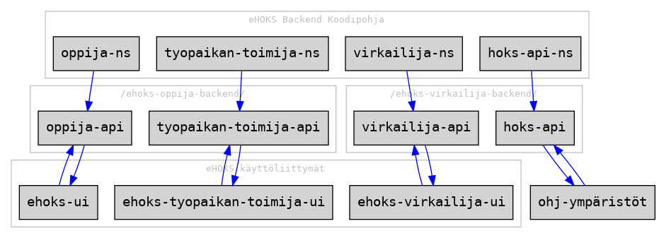
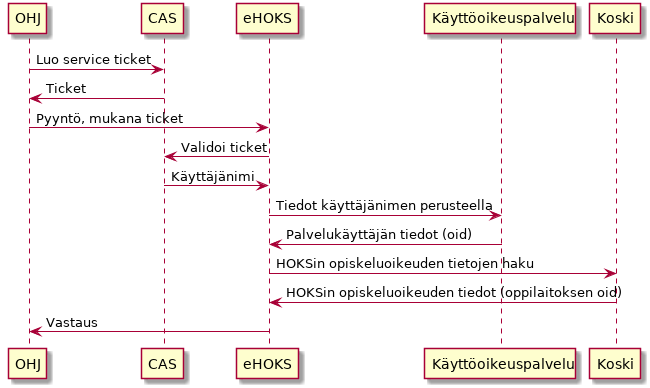
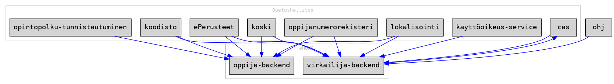

# eHOKS

## Arkkitehtuurista

eHOKS-backend on jaettu kahteen osaan: virkailija ja oppija. Virkailijan puoli
käsittää virkailijan käyttöliittymän rajapinnat ja datan tuontiin tarkoitetut
rajapinnat.



Tällä hetkellä sovellus jakaa koodipohjan eri osien välillä ja ainoastaan
rajapintojen polut on jaettu palveluittain.

## Teknologiat

### Frontend

[Github Repository](https://github.com/Opetushallitus/ehoks-ui)

### Backend

+ [Clojure 1.9.0](https://clojure.org/)
+ [Clojure.test](https://clojure.github.io/clojure/clojure.test-api.html)
+ [Compojure-api 2](https://github.com/metosin/compojure-api/)
+ [Leiningen](https://leiningen.org/)
+ [PostgreSQL 9.5](https://www.postgresql.org/docs/9.5/static/index.html)
+ [HugSQL](https://www.hugsql.org/)
+ [Flyway](https://flywaydb.org/)
+ [clj-http](https://github.com/dakrone/clj-http)
+ [Cheshire](https://github.com/dakrone/cheshire)
+ [Environ](https://github.com/weavejester/environ)
+ [Logback](https://logback.qos.ch/)
+ [tools.logging](https://github.com/clojure/tools.logging)

#### RESTful API
Backend pyrkii seuraamaan
[RESTful](https://en.wikipedia.org/wiki/Representational_state_transfer)
periaatteita. Kaikki vastaukset (paitsi no content) sisältävät meta- ja
dataobjektit.

Avaimet seuraavat Clojuren notaatiota.

## QA

[The Clojure Style Guidea](https://github.com/bbatsov/clojure-style-guide).


Repossa on `.editorconfig` jonka avulla voit kertoa editorillesi käytettävät
tyylit.

### Testien ajaminen

Kerran:

``` shell
lein test
```

Muutoksista:

``` shell
lein auto test
```

Testien kattavuus:

``` shell
lein with-profile test cloverage
```

### Lintterit

Staattiset linterit ajetaan:

``` shell
lein checkall
```

tämä ajaa Kibit, Bikeshed, Eastwood ja cljfmt kerralla. Jokainen työkalu on
ajettavissa myös erikseen:

``` shell
lein kibit
lein bikeshed
lein eastwood
lein cljfmt check
```

### Lisää tietoa

+ [kibit](https://github.com/jonase/kibit)
+ [lein-bikeshed](https://github.com/dakrone/lein-bikeshed)
+ [eastwood](https://github.com/jonase/eastwood)
+ [cljfmt](https://github.com/weavejester/cljfmt)

## Kehitys

### Ohjelman ajaminen

Ohjelmalle voi antaa parametrina sovelluksen nimen. Nimi on joko `ehoks`
(oppija) tai `ehoks-virkailija` (virkailija). Molemmat sovellukset on
oletuksena valittuna. Lisäksi ohjelma ottaa vastaan parametreina käytettävän
konfiguraatiotiedoston. Ohjelman nimen (`NAME`) ja konfiguraatiotiedoston
(`CONFIG`) voi antaa myös ympäristömuuttujana.

Tuotantomoodissa:

``` shell
lein run
```

Kehitysmoodissa:

``` shell
lein with-profile +dev run
```

tai

``` shell
lein with-profile +dev run ehoks-virkailija
```

Replissä `lein repl`:

``` repl
user> (use 'oph.ehoks.dev-server)
user> (def server (start-server "ehoks" nil))
```

Tai omalla konfiguraatiolla:

``` repl
user> (use 'oph.ehoks.dev-server)
user> (def server (start-server "ehoks-virkailija" "config/custom.edn"))
```

Ajossa olevat kokonaisuudet näkee replissä

``` repl
user> (System/getProperty “name”)
```

Tämän voi vaihtaa ajamalla replissä

``` repl
user> (System/setProperty “name” “ehoks-virkailija”)
```

ja lataamalla tiedoston [ehoks_app.clj](src/oph/ehoks/ehoks_app.clj) uudelleen replissä.

Ja ohjelman sammuttaminen:

``` repl
user> (.stop server)
```

### Tietokanta

Tietokannan migraatiot voi ajaa komennolla

``` shell
lein dbmigrate
```

Tietokannan voi tyhjätä komennolla

``` shell
lein dbclean
```

Tämän jälkeen migraatiot pitää ajaa uudelleen.

Migraatiot voi ajaa myös JAR:lla. Katso [Ajettava jar](#ajettava-jar)

Migraation voi luoda:

``` shell
lein genmigration /path/to/migrations "Title of the migration"
```

### Testit

Ulkoiset API-kutsut voidaan mockata. Kehitysresursseissa on konfiguroitava
HTTP-asiakasohjelma, jonka GET- ja POST-kutsut voidaan yliajaa. Tämä toimii
ainoastaan `test`-profiililla.

### PostgreSQL

Kontin luonti:

``` shell
cd scripts/postgres-docker
docker build -t ehoks-postgres .
docker volume create pgdata
```

Kontin ajaminen:

``` shell
docker run --rm --name ehoks-postgres -p 5432:5432 --volume pgdata:/var/lib/postgresql/data ehoks-postgres
```

### Schemat

Sovelluksessa on mahdollisuus generoida automaattisesti metodikohtaiset schemat.
Schemaan määritellään jokaiselle metodille sen access-type, joka voi olla
`:required`, `:optional` tai `:excluded`. Oletuksena access-type on `:required`.
Metodeiksi voi määritellä joko `:any`, `:get`, `:post`, `:put` tai `:patch`.
Myös tyypin voi määritellä metodikohtaiseksi.

Lähdescheman tyyppi tulee olla seuraavanlaista:

```
{:avain {:methods {:any :required
                   :post :excluded}
        :description "Jokin selite"
        :types {:any s/Int}}
 :toinen {:methods {:any :optional
                   :post :required}
          :description "Toinen selite"
          :types {:any s/Str
                  :get s/Int}}}
```

Lähdeschemaan täytyy lisätä metadataan nimi `:name`, `:doc` ja `:restful`-vipu
(`true`), jotta dokumentaatio generoituu oikein.

Restful-tyyppistä schemaa käytetään ainoastaan HTML-muotoisen
taulukkodokumentaation generointiin.

### Kehityksen endpointit

Sovellus tukee dummy-JSON-rajapintoja. Laita valmiit JSON-tiedostot kansioon
`resources/dev/dev-routes`. Tiedostoa vastaava endpoint luodaan automaattisesti
muuttamalla alaviivat kauttaviivoiksi. Esimerkiksi `/hello/world` endpoint
tarjoilee `hello_world.json`-tiedoston. Turvallisuussyistä ainoastaan tiedostot
kansiossa `dev-routes` luetaan ja endpointit toimivat ainoastaan
kehityspalvelimen kanssa.

### Dev tools

Kun sovellusta ajetaan dev-profiililla, on kehittäjälle tarjolla
dev-tools-rajapinta. Tämä on kokoelma erilaisia työkaluja, joilla voi muokata
helposti arvoja tietokannassa (oppijat ja opiskeluoikeudet) ja kirjautuneen
käyttäjän istuntoa. Istunnon muokkaus onnistuu sekä oppijan että virkailijan
puolella.

Paikallisessa kehityksessä on toteutettu mock-kirjautumiset, joihin pääset
käsiksi environmentista löytyvillä linkeillä.

[Sovelluksen environment](http://localhost:3000/ehoks-virkailija-backend/api/v1/misc/environment)

[Rajapinta](http://localhost:3000/dev-tools/)
Huom dev-tools rajapinnan Swagger-dokumentaatio ei tällä hetkellä toimi. Koodissa kommentti.

## Dummy-datan tuonti tietokantaan

Demodatan (HOKSit) voi tuoda komennolla `lein import path/to/demo.json`. Tämä
voi olla joko yksittäinen HOKS tai taulukko HOKSeja. ID:t tulee poistaa, koska
ne luodaan tietokantakohtaisesti.

## Konfigurointi

Oletuskonfiguraatio on `config/default.edn`. Arvoja voi yliajaa luomalla oman
konfiguraatiotiedoston ja antamalla sen joko `CONFIG`-ympäristömuuttujassa,
JVM system propertyssä `config` tai kehityspalvelimen parametrina.

Konfiguraatiotiedostot yhdistetään niin, että oma kustomoitu tiedosto yliajaa
vain ne arvot, mitkä siinä on määritelty. Konfiguraatio validoidaan ladattaessa.

### CAS-tunnistus

Sovellus käyttää CAS-tunnistautumista ulkoisten rajapintojen kanssa. Lisää
CAS-tunnukset ja sovelluksen tunniste (ent. client sub system code) ennen
rajapintojen käyttämistä.

## CAS

### Rajapinnat

Sovellus autentikoi rajapinnan kutsut CAS-palvelusta. Jokaisessa pyynnössä tulee
olla ticket mukana. Tämän perusteella haetaan palvelukäyttäjän tiedot ja
varmistetaan että käyttäjällä on oppijan opiskeluoikeuden kautta oikeus luoda
tai päivättää oppijan HOKSia.



Rajapintaa kutsuttaessa pitää tuoda seuraavat headerit:

| header | selite | Lisätietoa |
| ------ | ------ | ---------- |
| Caller-Id | OPH:n rajapintojen yhteinen tunniste | [Kutsujan tunnisteen (Caller-Id) lisääminen rajapintakutsuihin](https://confluence.csc.fi/pages/viewpage.action?pageId=50858064) |
| ticket | Validi CAS service ticket | [CAS-tunnistautuminen rajapinnassa (eHOKS)](https://confluence.csc.fi/pages/viewpage.action?pageId=79084600) |

## Ajettava jar

Ajettava jar riippuvuuksineen luodaan:

```
lein uberjar
```

Ja ajetaan:

``` shell
java -jar target/ehoks-standalone.jar
```

JAR:lle voi antaa myös komentoina `--help` tai `--run-migrations`. Jälkimmäinen
ajaa tietokantamigraatiot.

## Integraatiot

- CAS
- [ePerusteet](https://confluence.csc.fi/display/OPHPALV/ePerusteet)
- [Käyttöoikeuspalvelu](https://confluence.csc.fi/pages/viewpage.action?pageId=68725146)
- [Koodisto](https://confluence.csc.fi/display/OPHPALV/Koodistopalvelu)
- [KOSKI](https://confluence.csc.fi/display/OPHPALV/Koski-palvelukortti)
- [Lokalistointi](https://confluence.csc.fi/display/OPHPALV/Lokalisointipalvelu)
- [Oppijanumerorekisteri](https://confluence.csc.fi/display/OPHPALV/Oppijanumerorekisteri)




## Linkit

+ [eHOKS Confluence](https://confluence.csc.fi/display/OPHPALV/eHOKS+-+hanke)
