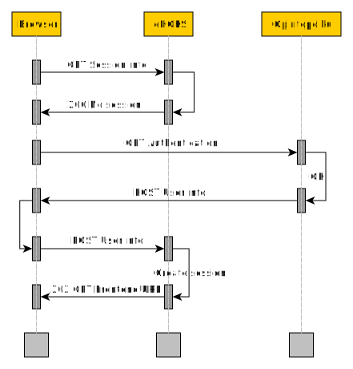

# Technical documentation

## Authentication

Application uses [Opintopolku](http://www.opintopolku.fi) authentication.

### Values

Authentication process returns information of authenticated user (oppija).
Values are (with few additions) from
[suomi.fi](https://palveluhallinta.suomi.fi/fi/tuki/artikkelit/590ad07b14bbb10001966f50)
authentication. Not all values are used and some values are renamed to follow
Clojure naming convention. Not all received values are server from API.

Following values are stored in session and some are served from API.

Value | Renamed | Description | API
------|---------|-------------|----
FirstName | :first-name | All first names | Yes
cn | :common-name | Surname following all first names | Yes
givenName | :given-name | Given name or first of first names | No
hetu | :hetu | Finnish national ID | No
oid | :oid | User ID | No
security | :security | Security ID | No
sn | :surname | Surname | Yes

### Sequence diagram



### API rajapintakuvaukset

Generointiin voi käyttää esimerkiksi
[swagger-markdown](https://www.npmjs.com/package/swagger-markdown) työkalua.

Käynnistä sovellus (oletuksena http://localhost:3000).


``` shell
curl -o api-doc.json http://localhost:3000/ehoks/doc/swagger.json
swagger-markdown -i api-doc.json
rm api-doc.json
```
